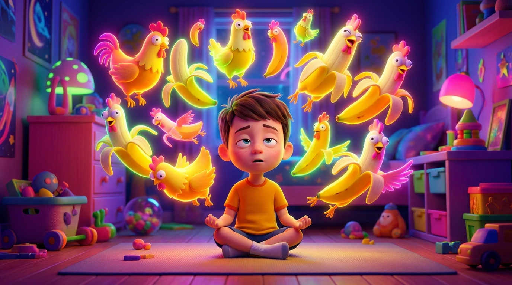

# ОТ CHICKEN BANANA К ХАРЕ КРИШНА: Чем мы наполняем умы наших детей?

## 1. Введение: Крючок и постановка проблемы

Наверняка многим родителям до боли знакома такая картина: ваш пятилетний или шестилетний ребенок бродит по дому, играет в свои игрушки и уже третий час подряд напевает какую-то прилипчивую, лишенную всякого смысла фразу из интернета. Что-то вроде вирусного трека «Chicken banana» или очередного бессмысленного звука из TikTok или YouTube Shorts. Вроде бы ничего страшного, обычная детская забава. Но почему-то от этого монотонного повторения у взрослых начинает немного звенеть в ушах, а сам ребенок, если его попытаться остановить, часто реагирует раздражением.

Давайте посмотрим на это явление с точки зрения нейробиологии. Современные алгоритмы социальных сетей — это не просто развлечение. Они создают идеальный **«цифровой фастфуд»**. Короткие, ритмичные, сверхъяркие ролики конструируются целыми командами маркетологов и психологов так, чтобы запускать в неокрепшем мозге «дофаминовую петлю» — быстрое, суррогатное удовольствие без малейших интеллектуальных или эмоциональных усилий. 

Ребенок повторяет эти бессмысленные строчки не потому, что они несут какую-то ценность, учат доброму или рассказывают интересную историю. Просто его мозг, словно на крючок, цепляется за примитивный, агрессивный ритм. Возникает так называемый эффект **«ушного червя»** — навязчивой мелодии, которую невозможно выбросить из головы.

Возникает очень важный вопрос: так ли уж безобидна эта привычка потреблять и воспроизводить информационный мусор? Детский ум в этом возрасте от природы жаждет повторений — именно так малыши познают мир, чувствуют безопасность в предсказуемости и тренируют речевой аппарат. Эта потребность совершенно естественна. Вопрос лишь в том, чем именно мы, как родители, заполняем этот сосуд детского восприятия?

## 2. Иллюзия материального звука: Эффект «Кока-Колы»

Чтобы глубже понять разницу между тем или иным наполнением ума, очень полезно обратиться к древней ведической философии. Согласно Ведам, в нашем обусловленном, материальном мире существует непреодолимая пропасть между названием вещи и самой вещью. Например, если вы изнываете от жажды и будете просто сидеть и повторять слово «вода», ваша жажда никуда не исчезнет. Звук и объект здесь разделены.

Известный духовный учитель и проповедник ведического знания **А.Ч. Бхактиведанта Свами Прабхупада** часто приводил для объяснения этого феномена гениальную и очень понятную аналогию: 
> *«Вы можете повторять "Кока-кола, кока-кола", но очень быстро устанете. Наступит пресыщение, так как это материальный звук».*

Вирусные песни-однодневки вроде «Chicken Banana» — это, по сути, та же самая цифровая Кока-кола. Поначалу они кажутся сладкими, бодрящими и забавными. Они привлекают внимание яркой упаковкой и громким звучанием. Но очень быстро они вызывают усталость, внутреннее опустошение и ментальное истощение. 

Более того, подобный контент активно формирует у детей так называемое **клиповое мышление**. Он приучает их развивающийся мозг к постоянному, непрерывному шумовому фону. Этот шум не питает сознание, не дает почвы для развития воображения, не учит эмпатии — он лишь перегружает хрупкую нервную систему ребенка, делая его гиперактивным, тревожным и неспособным к долгой концентрации внимания.

## 3. Духовный звук и его природа: Шабда-брахман и Нама-абхаса

Ведическая традиция противопоставляет этому пустому материальному звуку совершенно иное явление — **Шабда-брахман**, или трансцендентную, духовную звуковую вибрацию. Главное, принципиальное отличие духовного звука (мантры) заключается в том, что он неотличен от того Абсолюта, к которому обращен. В традиции гаудия-вайшнавизма считается, что Святое Имя (например, маха-мантра Харе Кришна) не имеет никаких отличий от Самого Всевышнего. В этом звуке заложена вся полнота духовной энергии. Именно поэтому повторение мантры, в отличие от "Кока-колы", никогда не вызывает пресыщения. Напротив, по мере углубления практики, она раскрывает для человека все новые и новые оттенки внутренней радости, умиротворения и чистоты.

Но как эта возвышенная философия работает с маленькими детьми, которые еще в силу возраста просто не способны к глубокой, сосредоточенной и осознанной медитации? Здесь на помощь приходит удивительная милостивая концепция, подробно описанная великим учителем и мыслителем XIX века Бхактивинодом Тхакуром. Она называется **Нама-абхаса** (буквально — «тень Святого Имени» или «отблеск Святого Имени»).

Секрет кроется в том, что духовный звук обладает такой невероятной, самодостаточной силой, что начинает работать и очищать сознание, даже если произносится совершенно неосознанно, без философского понимания. Ведические тексты выделяют несколько видов такого удивительного повторения:
* **Санкетья** — непреднамеренное произнесение (когда слово звучит похоже на Имя Бога или используется для называния чего-то другого).
* **Парихасья** — повторение в шутку или ради смеха.
* **Стобха** — использование мантры просто как красивого музыкального мотива, для заполнения паузы или как ритма во время другой деятельности.

Давайте сравним две ситуации. Когда ребенок ходит по дому и часами неосознанно напевает «Chicken banana», он лишь накапливает в уме информационный мусор, который в итоге делает его рассеянным и капризным. Но если тот же самый ребенок, играя в свои машинки или собирая кубики Lego, неосознанно напевает прилипчивый мотив киртана или мантры (практикуя *стобха Нама-абхасу*), происходит настоящее чудо. 

Даже этот неосознанный звук незаметно очищает его маленькое сердце. Более того, ребенок накапливает **агьята-сукрити** — неосознанное духовное благочестие. Это невидимый, но самый ценный капитал, который станет мощнейшим духовным фундаментом для его счастья, осознанности и правильных выборов во взрослой жизни.

## 4. Сила звука в формировании личности

Древние Упанишады и Веданта-сутра гласят, что все материальное творение начинается именно со звука. Звук — это не просто физическое колебание воздуха, это тонкая, всепроникающая сила, которая буквально лепит наше сознание и формирует реальность. 

То, какие звуки мы впускаем в умы наших детей в критически важном, восприимчивом возрасте (особенно от 5 до 7 лет), напрямую закладывает фундамент их будущих ценностей, мировоззрения и характера. В психологии и философии йоги эти глубокие впечатления называются **самскарами** — своего рода отпечатками, бороздками в подсознании. Если ребенок постоянно слушает дерганые, агрессивные или бессмысленные звуки, эти самскары формируют беспокойный ум. Если он слушает гармоничные, возвышенные вибрации — закладывается самскара покоя и радости.

Как мы уже говорили, жажда ритма, мелодии и постоянных повторений у ребенка — это абсолютная норма. Наша задача как любящих и осознанных родителей заключается не в том, чтобы заставить ребенка замолчать или перестать петь. Наша цель — **заменить разрушительный или пустой ритм на созидательный и вечный**. Мы должны дать пытливому детскому уму ту пищу, которая поможет ему стать сильным, глубоким и светлым.

## 5. Выводы и практические советы: Защита через замещение

Мы с вами живем в современном цифровом мире, и полностью изолировать детей от интернета и гаджетов не только практически невозможно, но зачастую и не нужно. Жесткие, авторитарные запреты в вопросах воспитания работают очень плохо: запретный плод всегда кажется ребенку слаще, а лишение любимого планшета часто вызывает лишь протест, слезы и отдаление от родителей. 

Ведическая философия предлагает нам куда более элегантный, мудрый и рабочий путь — **стратегию «высшего вкуса»**. Не нужно силой отнимать у ребенка дешевую карамельку, просто предложите ему вместо нее сочный, сладкий, спелый манго, и он сам отбросит леденец.

Как же мягко и экологично внедрить этот принцип в вашу повседневную семейную жизнь? Вот несколько практичных советов:

* **Аудит медиарациона.** Не стоит запрещать мультики полностью, но станьте внимательным куратором контента, который потребляет ваш ребенок. Оставьте четко выделенное время для экранов, но тщательно модерируйте то, что он смотрит. Убирайте из алгоритмов агрессивные, слишком быстро мелькающие и откровенно бессмысленные короткие ролики.
* **Мягкое замещение.** Все дети обожают музыку и ритм! Включайте дома фоном ритмичные, красивые детские бхаджаны, современные киртаны с приятной, качественной аранжировкой. Пусть этот чистый, возвышенный звук станет привычной атмосферой вашего дома, естественным и радостным саундтреком для их повседневных игр.
* **Личный пример.** Дети — наши самые точные и безжалостные зеркала. Если они видят, что вы сами с искренней радостью напеваете мантры, готовите под них еду, или по вечерам собираетесь вместе и играете на простых музыкальных инструментах (каратайлы, мриданга или гитара), они подхватят эту волну гораздо быстрее, чем любой вирусный тренд из сети. Энтузиазм родителей заразителен.
* **Осознанное обсуждение.** Если ребенок все же принес из детского садика, школы или интернета очередную «прилипчивую» бессмысленную песенку, не ругайте и не высмеивайте его. Задайте вопросы, которые включат его собственный разум: *«Ого, какая прилипчивая мелодия! А как ты думаешь, о чем эта песня? Она делает нас добрее или сильнее? Давай лучше вместе споем другую песню, в которой есть настоящая сила и волшебство»*.

Наполняя наш дом и умы наших детей духовным звуком, мы не просто отвлекаем их от экранов. Мы даем им самую надежную защиту в этом нестабильном и шумном мире — крепкий внутренний стержень, чистоту сознания и неподдельную радость, которая никогда не заканчивается.
